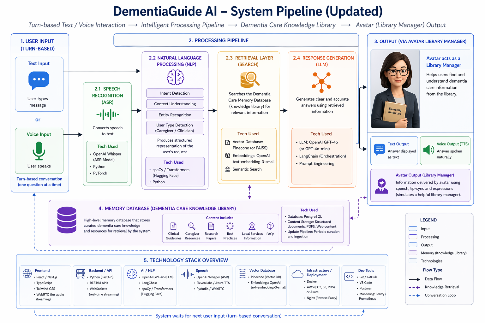

# DementiaGuide AI

A modern iOS mobile application that acts as a digital library manager for dementia care information. Users can ask questions through text or voice and receive responses through a human-like avatar interface powered by NVIDIA ACE.

---

## Application Workflow



---

## Overview

DementiaGuide AI is designed for caregivers, family members, and healthcare professionals. The app provides evidence-based dementia care guidance through a calm, accessible, and emotionally supportive interface. The AI avatar — **Aria** — responds in real time with natural speech, lip-sync, and expressive visual communication.

---

## Tech Stack

| Layer | Technology |
|---|---|
| Framework | React Native (Expo SDK 54) |
| Navigation | React Navigation 7 (Bottom Tabs + Native Stack) |
| Avatar & Speech | NVIDIA ACE (Tokkio · Riva ASR/TTS · Audio2Face) |
| Animations | React Native Reanimated + Animated API |
| Gradients | expo-linear-gradient |
| Audio | expo-av |
| Haptics | expo-haptics |
| Safe Area | react-native-safe-area-context |

---

## Screens

| Screen | Description |
|---|---|
| **Home** | Avatar hero card, quick question chips, text/voice entry, navigation grid |
| **Chat** | iMessage-style conversation with bubble tails, typing indicator, suggestion chips |
| **Library** | Searchable knowledge base across 6 dementia-care categories |
| **Voice** | Full-screen voice UI with real-time waveform, state machine, and transcript |
| **Settings** | Accessibility controls — text size, contrast, audio, subtitles, haptics, privacy |

---

## Project Structure

```
DementiaGuideAi/
├── App.js                          # Root entry point
├── babel.config.js
├── app.json                        # Expo config
├── src/
│   ├── navigation/
│   │   └── AppNavigator.js         # Bottom tab + stack navigator
│   ├── screens/
│   │   ├── HomeScreen.js
│   │   ├── ChatScreen.js
│   │   ├── LibraryScreen.js
│   │   ├── VoiceScreen.js
│   │   └── ProfileScreen.js
│   ├── components/
│   │   ├── Avatar.js               # Animated avatar (idle / listening / speaking)
│   │   ├── MessageCard.js          # Chat bubble with sources and actions
│   │   ├── CategoryCard.js         # Library category row
│   │   └── VoiceWaveform.js        # 9-bar animated waveform
│   ├── constants/
│   │   ├── colors.js               # Full design token palette
│   │   ├── typography.js           # Type scale and font config
│   │   └── data.js                 # Categories, resources, sample messages
│   └── services/
│       ├── aceService.js           # NVIDIA ACE integration (Tokkio stub)
│       └── knowledgeService.js     # Knowledge base search stub
```

---

## Getting Started

### Prerequisites

- Node.js 20+
- Expo CLI
- Xcode (for iOS Simulator) or Expo Go on a physical device

### Install

```bash
git clone <repo-url>
cd DementiaGuideAi
npm install
```

### Run

```bash
# iOS Simulator
npx expo start --ios

# Android
npx expo start --android

# Clear Metro cache if needed
npx expo start --ios --clear
```

---

## NVIDIA ACE Integration

The avatar experience is powered by [NVIDIA ACE (Avatar Cloud Engine)](https://developer.nvidia.com/ace). The integration architecture is documented in `src/services/aceService.js`.

**Production pipeline:**

```
User audio → Riva ASR → NIM LLM → RAG knowledge base
                                         ↓
                               Riva TTS + Audio2Face
                                         ↓
                              WebRTC avatar video stream
```

**To connect a real ACE instance**, set the following environment variables:

```bash
EXPO_PUBLIC_ACE_ENDPOINT=wss://your-tokkio-instance/v1/session
EXPO_PUBLIC_ACE_API_KEY=your-api-key
```

The service currently runs a mock response loop for development and testing.

---

## Design System

The UI follows iOS Human Interface Guidelines with a calm, accessible palette.

| Token | Value | Use |
|---|---|---|
| Primary | `#4A7C8E` | Buttons, links, user bubbles |
| Secondary | `#7FB5A0` | Accents, success states |
| Accent | `#E8956D` | Warnings, speaking state |
| Background | `#F7F5F2` | App background |
| Surface | `#FFFFFF` | Cards, nav bar |
| Text Primary | `#1E2D3D` | Body and headings |

**Accessibility features:**
- Minimum 44×44pt tap targets throughout
- `accessibilityLabel` and `accessibilityRole` on all interactive elements
- Configurable text size (small / medium / large)
- High contrast mode toggle
- Subtitle and audio toggles for avatar responses
- Haptic feedback toggle

---

## Disclaimer

DementiaGuide AI provides information for general guidance only. It is not a substitute for professional medical advice, diagnosis, or treatment. Always consult a qualified healthcare provider for dementia-related concerns.

---

## License

Private — all rights reserved.
