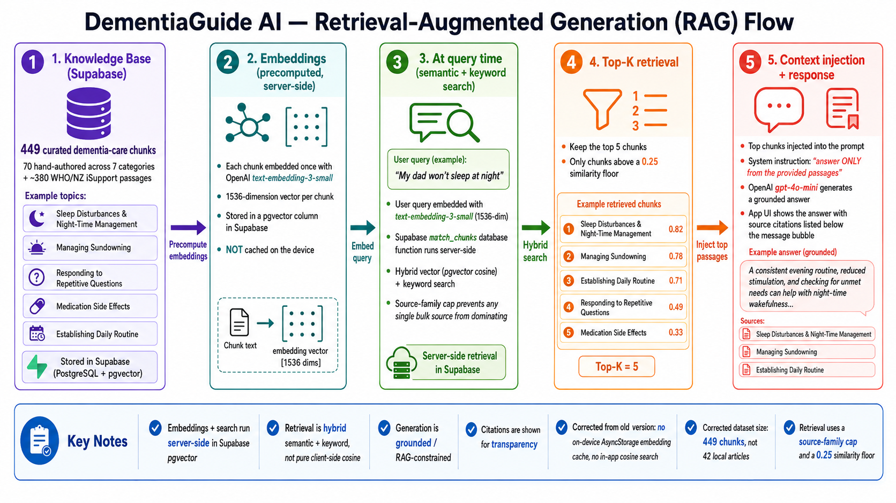

# DementiaGuide AI

A modern iOS mobile application that acts as a digital library for dementia care information. Users can ask questions through text or voice and receive responses through a real-time 3D avatar with lip-sync driven by ElevenLabs character-level alignment.

---

## Application Workflow


## RAG Pipeline Workflow



---

## Overview

DementiaGuide AI is designed for caregivers, family members, and healthcare professionals. The app provides evidence-based dementia care guidance through a calm, accessible, and emotionally supportive interface. The AI avatar — **Aria** — is a VRM model rendered in real time with natural speech, multi-shape lip-sync driven by ElevenLabs character-level alignment, and expressive idle animations.

---

## Tech Stack

| Layer | Technology |
|---|---|
| Framework | React Native (Expo SDK 54) |
| Navigation | React Navigation 7 (Bottom Tabs + Native Stack) |
| AI / RAG | OpenAI `gpt-4o-mini` + `text-embedding-3-small` |
| Vector DB | Supabase (pgvector) — cloud-hosted knowledge base with `match_chunks` RPC |
| STT | OpenAI Whisper (`whisper-1`) via `expo-av` audio recording |
| TTS | ElevenLabs `eleven_turbo_v2_5` (primary) · OpenAI `tts-1` (fallback) |
| Lip Sync | ElevenLabs character-level alignment → viseme timeline → 5 VRM blend shapes |
| Avatar | VRM 3D model via Three.js r180 + `@pixiv/three-vrm` in a WebView |
| Animations | React Native Animated API |
| Gradients | expo-linear-gradient |
| Audio | expo-av · Web Audio API (WebView) |
| Haptics | expo-haptics |
| Safe Area | react-native-safe-area-context |
| Storage | `@react-native-async-storage/async-storage` · `expo-secure-store` |

---

## Screens

| Screen | Description |
|---|---|
| **Home** | Avatar hero card, quick question chips, text/voice entry, navigation grid |
| **Chat** | iMessage-style conversation, typing indicator, clickable source links |
| **Library** | Searchable knowledge base across 6 dementia-care categories with article detail view |
| **Voice** | Full-screen voice UI — records via Whisper STT, streams LLM response, plays avatar speech sentence-by-sentence with lip sync |
| **Settings** | Accessibility controls — text size, contrast, audio, subtitles, haptics, privacy |

---

## Project Structure

The app is organised **feature-first**: each domain owns its screens, components, hooks
and config under `src/features/<domain>/`. Cross-cutting concerns live in a shared kernel
(`theme/`, `context/`, `constants/`, top-level `components/`) and all external integrations
+ pure engines live in a single `lib/`. Imports use the `@/` path alias (`@/` → `src/`).

Files are migrating to **TypeScript** incrementally — the shared kernel and integration
layer are typed (`.ts`/`.tsx`); screens and the avatar/provider modules remain `.js` under
`allowJs` and convert in later passes.

```
DementiaGuideAI/
├── App.js
├── tsconfig.json · babel.config.js · eslint.config.js · jest.config.js · .prettierrc
├── app.json                          # Expo config
├── scripts/                          # Node CLI tools (RAG eval, Supabase migration, …)
└── src/
    ├── navigation/
    │   └── AppNavigator.js           # Root bottom-tab + stack navigator (app shell)
    ├── features/
    │   ├── home/screens/HomeScreen.js
    │   ├── chat/screens/ChatScreen.js
    │   ├── voice/                     # Voice conversation (Whisper → LLM → TTS → avatar)
    │   │   ├── screens/VoiceScreen.js
    │   │   ├── components/VoiceWaveform.js
    │   │   └── hooks/useAvatarConversation.js
    │   ├── avatar/                    # Avatar rendering + Unity bridge
    │   │   ├── components/{AvatarVRM,AvatarUnity}.js
    │   │   ├── config/avatarProfiles.ts
    │   │   └── bridge/{UnityAvatarBridge,blendshapeTranslator,AvatarBridgeProtocol}.js
    │   ├── library/                   # Knowledge-base browsing
    │   │   ├── screens/{LibraryScreen,ArticleDetailScreen}.js
    │   │   ├── components/CategoryCard.js
    │   │   └── data/knowledgeBase.js  # Local KB (source-of-truth backup; runtime uses Supabase)
    │   ├── onboarding/
    │   │   ├── navigation/OnboardingNavigator.js
    │   │   ├── screens/*.js           # 12-step onboarding flow
    │   │   └── components/*.js         # OnboardingLayout, OptionCard, ProgressBar, SummaryRow
    │   └── settings/screens/ProfileScreen.js
    ├── components/                    # Shared, cross-feature UI (Avatar, MessageCard)
    ├── lib/                           # Integrations + pure engines
    │   ├── openaiService.js           # RAG pipeline (embed → Supabase match_chunks → streaming chat)
    │   ├── supabaseService.ts         # Supabase anon client
    │   ├── knowledgeService.ts        # Library KB queries (Supabase)
    │   ├── aceService.js              # NVIDIA ACE stub
    │   ├── types.ts                   # Shared service-layer domain types
    │   ├── tts/                       # ttsService.ts (provider selection) + Azure/ElevenLabs
    │   ├── sentiment/detectSentiment.ts
    │   └── lipsync/                   # Alignment → viseme timeline (shared with Unity test tools)
    ├── theme/                         # colors.ts, typography.ts (design tokens)
    ├── constants/data.js              # Categories, resources, sample messages
    └── context/SettingsContext.tsx    # App-wide settings + theme provider
```

### Scripts

| Command | What it does |
|---|---|
| `npm start` | Start the Expo dev server |
| `npm run typecheck` | `tsc --noEmit` |
| `npm run lint` | ESLint (`eslint-config-expo`) |
| `npm run format` | Prettier write |
| `npm test` | Jest (`jest-expo`) |

---

## Getting Started

### Prerequisites

- Node.js 20+
- Expo CLI
- Xcode (for iOS Simulator) or Expo Go on a physical device
- An OpenAI API key
- A Supabase project (free tier) with pgvector enabled
- An ElevenLabs API key (optional — enables vowel-accurate lip sync; falls back to amplitude-based sync without it)

### Install

```bash
git clone <repo-url>
cd DementiaGuideAI
npm install
```

### Environment setup

Copy `.env.example` to `.env` and fill in your keys:

```bash
cp .env.example .env
```

```env
# Mobile app (Expo) — anon key is safe to use client-side
EXPO_PUBLIC_SUPABASE_URL=https://<your-project>.supabase.co
EXPO_PUBLIC_SUPABASE_ANON_KEY=<anon_key>

# Scripts — service role key (never expose to clients)
SUPABASE_URL=https://<your-project>.supabase.co
SUPABASE_SERVICE_ROLE_KEY=<service_role_key>
OPENAI_API_KEY=sk-...
```

### Supabase setup (first time only)

Run `scripts/supabase-setup.sql` in the Supabase SQL Editor to create the `knowledge_chunks` table, the pgvector index, and the `match_chunks` RPC function.

Then seed the knowledge base:

```bash
node scripts/migrate-to-supabase.mjs
```

### Run the mobile app

```bash
# iOS Simulator
npx expo start --ios

# Android
npx expo start --android

# Clear Metro cache if needed
npx expo start --ios --clear
```

### API Key Setup (mobile app)

Enter your API keys in the app under **Settings → AI Configuration**:
- **OpenAI key** — required for chat, STT (Whisper), and fallback TTS
- **ElevenLabs key** — optional; enables the full viseme lip sync pipeline

Both keys are stored securely via `expo-secure-store` and never leave the device.

---

## Voice Conversation Pipeline

The Voice screen runs a fully pipelined conversation flow managed by `useAvatarConversation.js`:

```
[Microphone] → expo-av recording
     ↓
[Whisper STT] → transcribed text
     ↓
[OpenAI gpt-4o-mini stream] → tokens arrive sentence by sentence
     ↓
[ElevenLabs TTS] ← fires immediately per sentence, in parallel
     ↓
[Viseme timeline] ← character alignment → mouth shape keyframes
     ↓
[AvatarVRM WebView] → plays audio + drives 5 blend shapes in real time
```

Each sentence is sent to TTS as soon as it completes in the LLM stream — so the avatar begins speaking the first sentence while later sentences are still being generated.

---

## Avatar (AvatarVRM)

The avatar is a `.vrm` model rendered inside a React Native `WebView` using Three.js and `@pixiv/three-vrm`. All animation runs in the embedded browser context and communicates back to React Native via `postMessage`.

**State machine:** `idle → listening → thinking → speaking`

Each state drives:
- Body bob and sway amplitude
- Head look-around frequency and range
- Thinking gaze bias (up-right)
- Breathing depth on spine/chest bones

**Lip sync — ElevenLabs viseme path (primary)**

ElevenLabs returns character-level timestamps alongside the audio. These are converted into a viseme frame sequence by `createVisemeTimeline.js`, mapping characters to one of five VRM blend shapes: `aa` (open), `ih` (smile-open), `ou` (round), `ee` (wide), `oh` (rounded-open). During playback, the WebView tracks `AudioContext.currentTime` each frame, binary-searches the viseme timeline, and cross-fades between the active and next frame over the final 20% of each frame's duration.

**Lip sync — RMS fallback path (OpenAI TTS or no ElevenLabs key)**

When no alignment data is available, a Web Audio `AnalyserNode` measures RMS amplitude per frame and maps it to the `aa` blend shape, producing open/close jaw movement that tracks the audio loudness.

**Recovery:** If the WebGL context is lost (iOS background eviction, Android process kill), the WebView automatically remounts.

**Custom VRM model:** Pass a `modelUrl` prop to `AvatarVRM` to use any publicly hosted `.vrm` file.

```jsx
<AvatarVRM
  ref={avatarRef}
  modelUrl="https://example.com/your-model.vrm"
  isListening={listening}
  isSpeaking={speaking}
  isThinking={thinking}
  width={300}
  height={420}
/>

// Play TTS audio with viseme lip sync (ElevenLabs path)
await avatarRef.current.playAudio({ audio: base64DataUri, visemeTimeline });

// Play TTS audio with RMS fallback
await avatarRef.current.playAudio(base64DataUri);

// Stop early
avatarRef.current.stopAudio();
```

---

## RAG Pipeline

The chat is powered by a cloud RAG pipeline using Supabase pgvector and OpenAI.

| Setting | Value |
|---|---|
| Embedding model | `text-embedding-3-small` (1536 dims) |
| Chat model | `gpt-4o-mini` |
| Vector DB | Supabase `knowledge_chunks` table (pgvector `vector(1536)`) |
| Retrieval | Top-5 chunks via `match_chunks` RPC, min cosine similarity 0.25 |
| Context window | Last 6 messages |
| Chunk size | ~500 words with ~50-word overlap |
| Auto-tagging | GPT-4o-mini assigns 5–8 specific tags per chunk at ingestion time |

**Flow:**

```
User query
  → embed via text-embedding-3-small
  → Supabase match_chunks RPC (server-side cosine similarity)
  → top-5 chunks injected as context
  → gpt-4o-mini streaming response with source attribution
```

### Adding content to the knowledge base

Use the CLI ingestion script:

```bash
# From a URL
node scripts/ingest.mjs \
  --source "https://www.alzheimers.org.uk/some-article" \
  --category clinical \
  --org "Alzheimer's Society UK"

# From a local PDF
node scripts/ingest.mjs \
  --source "./documents/care-guide.pdf" \
  --category caregiving \
  --org "Dementia Australia"

# Preview without uploading
node scripts/ingest.mjs --source <url> --category <slug> --org <name> --dry-run
```

Valid categories: `caregiving` · `clinical` · `communication` · `prevention` · `best-practices` · `home-safety` · `well-being`

### Testing RAG output

```bash
OPENAI_API_KEY=sk-... node scripts/test-responses.mjs
```

Runs a set of sample questions through the full pipeline and prints each response alongside the retrieved chunks and their similarity scores.

---

## Design System

| Token | Value | Use |
|---|---|---|
| Primary | `#4A7C8E` | Buttons, links, user bubbles |
| Secondary | `#7FB5A0` | Accents, success states |
| Accent | `#E8956D` | Warnings, speaking state |
| Background | `#F7F5F2` | App background |
| Surface | `#FFFFFF` | Cards, nav bar |
| Text Primary | `#1E2D3D` | Body and headings |

**Accessibility:**
- Minimum 44×44pt tap targets
- `accessibilityLabel` and `accessibilityRole` on all interactive elements
- Configurable text size (small / medium / large)
- High contrast mode toggle
- Subtitle and audio toggles for avatar responses
- Haptic feedback toggle

---

## Disclaimer

DementiaGuide AI provides information for general guidance only. It is not a substitute for professional medical advice, diagnosis, or treatment. Always consult a qualified healthcare provider for dementia-related concerns.

---

## License

Private — all rights reserved.
