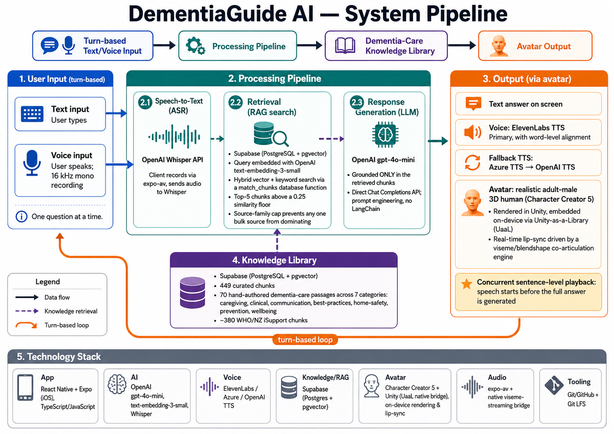
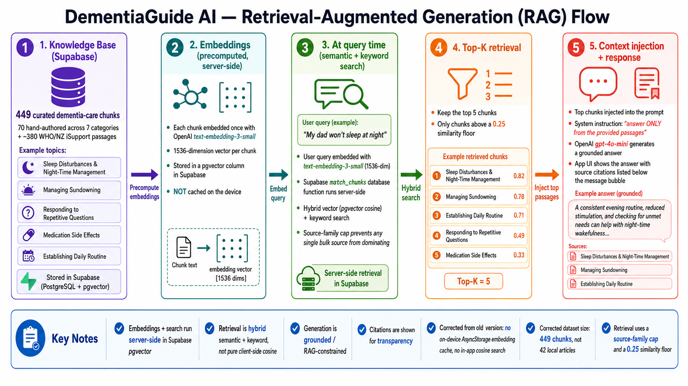

# DementiaGuide AI

An **avatar-based digital resource platform for dementia care**, running on iOS,
Android and the web.

It helps caregivers, family members and healthcare professionals **access,
navigate and organise** dementia-care resources — held in a searchable,
categorised knowledge base — and get **grounded, cited answers** to questions
asked by text or voice, delivered by a real-time 3D avatar with lip sync driven
by ElevenLabs character-level alignment.

Two ways of working with care information, in one place:

- a **Library** of curated, provenance-tracked resources across six dementia-care
  categories, searchable and browsable; and
- a **conversational RAG assistant** that answers with inline citations back to
  that same knowledge base — never from the model's own memory.

The experience is tailored through a guided 12-step onboarding flow and
accessibility settings (text size, contrast, audio, subtitles, haptics).





> The diagrams are illustrative. The authoritative configuration is
> `packages/core/rag/ragConfig.js` — see [docs/rag/](docs/rag/README.md) for the
> current models and retrieval settings.

---

## Repository map

Three surfaces share one knowledge base and one RAG core:

| Path | What it is | Run it |
|---|---|---|
| `src/` + `App.js` | **Mobile app** — Expo / React Native. The repo root *is* the Expo project. | `npm start` |
| `web/` | **Web app** — Vite + React, deployed on Vercel. Own `package.json` and tests. | `cd web && npm run dev` |
| `packages/core/` | **Shared logic** — RAG config, prompt, retrieval, citations + small utilities. Imported by mobile, web **and** Node. | — |
| `unity-avatar/` | **Unity avatar project** (git submodule) — CC4 characters and their exporters. | — |
| `modules/unity-avatar-module/` | Local Expo native module embedding Unity-as-a-Library. Autolinked, not an npm dependency. | — |
| `plugins/` | Expo config plugin wiring the Unity library into the generated native projects. | — |
| `scripts/` | Node/Python tooling: `eval/`, `ingest/`, `migrations/`. | `npm run rag:*`, `kb:*` |
| `content/` | Source documents for ingestion (PDFs gitignored; `sources/MANIFEST.md` is the record). | — |
| `docs/` | All documentation. | — |
| `assets/` | Icons, splash, and the `.glb`/`.vrm` avatar models (shared by mobile and web). | — |

`android/` and `ios/` are generated by `expo prebuild` and are not tracked.

---

## Quick start

**Prerequisites:** Node 20 (see `.nvmrc`), an OpenAI API key, and a Supabase
project with pgvector enabled. Xcode or Expo Go for mobile. An ElevenLabs key is
optional — it enables vowel-accurate lip sync instead of amplitude-based.

```bash
git clone <repo-url> && cd DementiaGuideAI
npm install
cp .env.example .env      # fill in Supabase + OpenAI values
```

First time only, create the schema: run `scripts/supabase-setup.sql` in the
Supabase SQL editor, apply anything pending from `scripts/migrations/` (see that
folder's README for run order), then seed:

```bash
npm run kb:ingest -- --doc curated
```

**Mobile**

```bash
npx expo start --ios      # or --android
```

**Web** — a separate npm project:

```bash
cd web && npm install
cp .env.example .env      # VITE_* equivalents of the mobile EXPO_PUBLIC_* vars
npm run dev
```

Without an OpenAI key the web app runs in **mock mode** (canned replies, no API
calls); enter keys in-app to switch to the real pipeline.

> The Unity 3D avatar needs a full native build (`npx expo run:ios` on a device,
> or `npx expo run:android`) with the Unity export present. Everything else —
> chat, voice, library — works in Expo Go and the Simulator, where the avatar
> area shows a fallback. On web the Unity WebGL build must be synced in with
> `npm run sync:unity`, otherwise the Three.js avatar is used.

Full setup, native builds and the Android/Unity toolchain:
[docs/mobile-app.md](docs/mobile-app.md).

---

## Documentation

Start at **[docs/README.md](docs/README.md)**.

| Doc | What it covers |
|---|---|
| [Mobile app](docs/mobile-app.md) | Tech stack, screens, structure, path aliases, native builds, API keys |
| [Web app](web/README.md) | Vite app, mock vs real mode, Vercel deploy |
| [Shared core](packages/core/README.md) | What may live in `@core`, and why the boundary exists |
| [RAG pipeline](docs/rag/README.md) | Config, ingestion, evaluation + the research docs |
| [Avatar & voice](docs/avatar.md) | Renderers, conversation pipeline, lip sync |
| [Backend plan](docs/architecture/backend-plan.md) | The planned backend + DB (not built) |
| [Design system](docs/design-system.md) | Tokens and accessibility requirements |
| [Contributing](CONTRIBUTING.md) | Setup, where code goes, required checks, known traps |

---

## Scripts

Run from the repo root unless noted.

| Command | What it does |
|---|---|
| `npm start` | Expo dev server |
| `npm run ios` / `android` | Native build + run — required for the Unity avatar |
| `npm run typecheck` | `tsc --noEmit` |
| `npm run lint` | ESLint (`eslint-config-expo`) |
| `npm run format` / `format:check` | Prettier write / check |
| `npm test` | Jest — covers `src/` and `packages/core/` |
| `npm run kb:ingest` / `kb:ingest:dry` | Ingest sources into Supabase / plan only |
| `npm run rag:eval:*`, `rag:grade`, `rag:introspect` | RAG evaluation suite — see [docs/rag/](docs/rag/README.md) |

Inside `web/`: `npm run dev`, `build`, `preview`, `test` (Vitest, includes the
mobile↔web interop tests), and `sync:unity`.

---

## Disclaimer

DementiaGuide AI provides information for general guidance only. It is not a
substitute for professional medical advice, diagnosis, or treatment. Always
consult a qualified healthcare provider for dementia-related concerns.

## License

Proprietary — all rights reserved. See [LICENSE](LICENSE).

The repository is publicly readable for academic and portfolio purposes; that
does **not** grant permission to use, copy, modify or redistribute the code.
