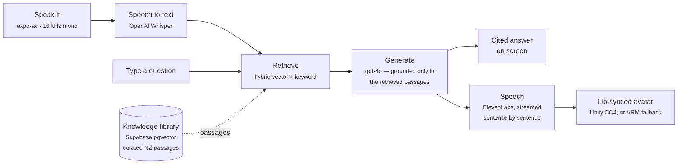
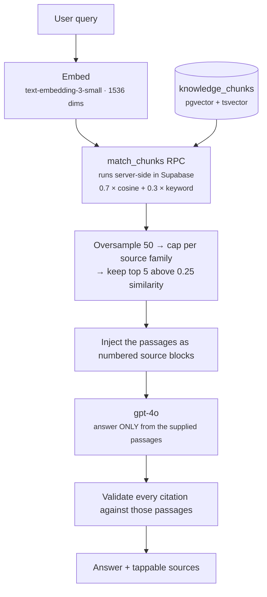

# DementiaGuide AI

An **avatar-based digital resource platform for dementia care**, running on iOS,
Android and the web.

It helps caregivers, family members and healthcare professionals **access,
navigate and organise** dementia-care resources — held in a searchable,
categorised knowledge base — and get **grounded, cited answers** to questions
asked by text or voice, delivered by a real-time 3D avatar with lip sync driven
by ElevenLabs character-level alignment.

Two ways of working with care information, in one place:

- a **Library** of curated, provenance-tracked resources across six dementia-care
  categories, searchable and browsable; and
- a **conversational RAG assistant** that answers with inline citations back to
  that same knowledge base — never from the model's own memory.

The experience is tailored through a guided 12-step onboarding flow and
accessibility settings (text size, contrast, audio, subtitles, haptics).

## How it works


```mermaid
flowchart LR
    mic["Speak it<br/><small>expo-av · 16 kHz mono</small>"] --> stt["Speech to text<br/><small>OpenAI Whisper</small>"]
    stt --> ret
    txt["Type a question"] --> ret

    ret["Retrieve<br/><small>hybrid vector + keyword</small>"] --> gen["Generate<br/><small>gpt-4o — grounded only in<br/>the retrieved passages</small>"]
    kb[("Knowledge library<br/><small>Supabase pgvector<br/>curated NZ passages</small>")] -. passages .-> ret

    gen --> screen["Cited answer<br/>on screen"]
    gen --> tts["Speech<br/><small>ElevenLabs, streamed<br/>sentence by sentence</small>"]
    tts --> avatar["Lip-synced avatar<br/><small>Unity CC4, or VRM fallback</small>"]
```

Speech starts before the full answer is generated: each sentence is sent to TTS
as soon as it completes in the model stream.

### Retrieval in detail


```mermaid
flowchart TB
    q["User query"] --> emb["Embed<br/><small>text-embedding-3-small · 1536 dims</small>"]
    emb --> rpc["match_chunks RPC<br/><small>runs server-side in Supabase<br/>0.7 × cosine + 0.3 × keyword</small>"]
    store[("knowledge_chunks<br/><small>pgvector + tsvector</small>")] --> rpc
    rpc --> cap["Oversample 50 → cap per source family<br/>→ keep top 5 above 0.25 similarity"]
    cap --> inject["Inject the passages as numbered source blocks"]
    inject --> llm["gpt-4o<br/><small>answer ONLY from the supplied passages</small>"]
    llm --> validate["Validate every citation against those passages"]
    validate --> ans["Answer + tappable sources"]
```

Retrieval and embedding run **server-side in Supabase** — there is no on-device
vector search. Exact models and thresholds live in
`packages/core/rag/ragConfig.js`; see [docs/rag/](docs/rag/README.md).

---

## Repository map

An npm-workspaces monorepo. Three surfaces share one knowledge base and one RAG
core:

| Path             | What it is                                                                                                                                                       | Run it                  |
| ---------------- | ---------------------------------------------------------------------------------------------------------------------------------------------------------------- | ----------------------- |
| `apps/mobile/`   | **Mobile app** — Expo / React Native, iOS + Android.                                                                                                             | `npm start`             |
| `apps/web/`      | **Web app** — Vite + React, deployed on Vercel.                                                                                                                  | `npm run web`           |
| `packages/core/` | **Shared logic** — RAG config, prompt, retrieval, citations, voice/TTS/lip-sync engines and small utilities. Imported by mobile, web **and** Node, as `@core/…`. | —                       |
| `scripts/`       | Node/Python tooling: `migrations/`, `ingest/`, `eval/`.                                                                                                          | `npm run rag:*`, `kb:*` |
| `assets/`        | The `.glb` avatar models, shared by both apps as `@assets/…`. App icons live in `apps/mobile/assets/`.                                                           | —                       |
| `unity-avatar/`  | **Unity avatar project** (git submodule) — CC4 characters and their exporters.                                                                                   | —                       |
| `content/`       | Source documents for ingestion (PDFs gitignored; `sources/MANIFEST.md` is the record).                                                                           | —                       |
| `docs/`          | All documentation.                                                                                                                                               | —                       |

Inside `apps/mobile/`, `modules/unity-avatar-module/` is a local Expo native
module embedding Unity-as-a-Library (autolinked by convention, not an npm
dependency), and `plugins/` holds the config plugin that wires it into the
generated native projects. `apps/mobile/{ios,android}/` are `expo prebuild`
output and are not tracked.

One lockfile at the root covers every workspace — `npm install` once, from the
root. `react`, `three` and `@supabase/supabase-js` are held at matching versions
across both apps so the shared code compiles against a single copy of each.

---

## Quick start

**Prerequisites:** Node 20 (see `.nvmrc`), an OpenAI API key, and a Supabase
project with pgvector enabled. Xcode or Expo Go for mobile. An ElevenLabs key is
optional — it enables vowel-accurate lip sync instead of amplitude-based.

```bash
git clone <repo-url> && cd DementiaGuideAI
npm install               # once, at the root — covers every workspace
cp .env.example .env                    # Supabase + OpenAI, for mobile and the scripts
cp apps/web/.env.example apps/web/.env  # VITE_* equivalents for the web app
```

First time only, create the schema and seed the corpus — run order and status
are in [scripts/README.md](scripts/README.md):

```bash
npm run kb:ingest -- --doc curated
```

**Mobile**

```bash
npm start                 # or: npm run ios / npm run android
```

**Web**

```bash
npm run web
```

Without an OpenAI key the web app runs in **mock mode** (canned replies, no API
calls); enter keys in-app to switch to the real pipeline.

> The Unity 3D avatar needs a full native build (`npx expo run:ios` on a device,
> or `npx expo run:android`) with the Unity export present. Everything else —
> chat, voice, library — works in Expo Go and the Simulator, where the avatar
> area shows a fallback. On web the Unity WebGL build must be synced in with
> `npm run sync:unity`, otherwise the Three.js avatar is used.

Full setup, native builds and the Android/Unity toolchain:
[docs/mobile-app.md](docs/mobile-app.md).

---

## Documentation

Start at **[docs/README.md](docs/README.md)**.

| Doc                                               | What it covers                                                        |
| ------------------------------------------------- | --------------------------------------------------------------------- |
| [Mobile app](docs/mobile-app.md)                  | Tech stack, screens, structure, path aliases, native builds, API keys |
| [Web app](apps/web/README.md)                     | Vite app, mock vs real mode, Vercel deploy                            |
| [Shared core](packages/core/README.md)            | What may live in `@core`, and why the boundary exists                 |
| [RAG pipeline](docs/rag/README.md)                | Config, ingestion, evaluation + the research docs                     |
| [Avatar & voice](docs/avatar.md)                  | Renderers, conversation pipeline, lip sync                            |
| [Backend plan](docs/architecture/backend-plan.md) | The planned backend + DB (not built)                                  |
| [Design system](docs/design-system.md)            | Tokens and accessibility requirements                                 |
| [Contributing](CONTRIBUTING.md)                   | Setup, where code goes, required checks, known traps                  |

---

## Scripts

All of these run from the repo root; the workspace ones delegate with `-w`.

| Command                                             | What it does                                                 |
| --------------------------------------------------- | ------------------------------------------------------------ |
| `npm start`                                         | Expo dev server                                              |
| `npm run ios` / `android`                           | Native build + run — required for the Unity avatar           |
| `npm run web`                                       | Vite dev server                                              |
| `npm run typecheck`                                 | `tsc --noEmit` over the mobile app + `packages/core`         |
| `npm run lint`                                      | ESLint across both apps and `packages/core`                  |
| `npm run format` / `format:check`                   | Prettier write / check                                       |
| `npm test`                                          | Both suites: Jest (mobile + core + scripts) and Vitest (web) |
| `npm run test:mobile` / `test:web`                  | One suite at a time                                          |
| `npm run kb:ingest` / `kb:ingest:dry`               | Ingest sources into Supabase / plan only                     |
| `npm run rag:eval:*`, `rag:grade`, `rag:introspect` | RAG evaluation suite — see [docs/rag/](docs/rag/README.md)   |

Web-only extras, via `-w apps/web`: `build`, `preview`, and `sync:unity`.

---

## Disclaimer

DementiaGuide AI provides information for general guidance only. It is not a
substitute for professional medical advice, diagnosis, or treatment. Always
consult a qualified healthcare provider for dementia-related concerns.

## License

Proprietary — all rights reserved. See [LICENSE](LICENSE).

The repository is publicly readable for academic and portfolio purposes; that
does **not** grant permission to use, copy, modify or redistribute the code.
