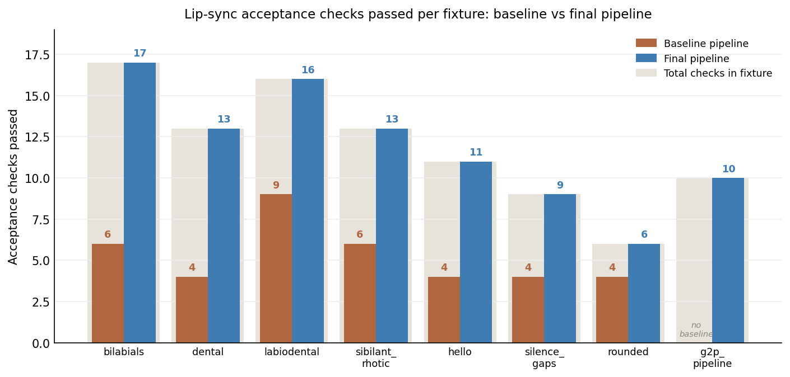
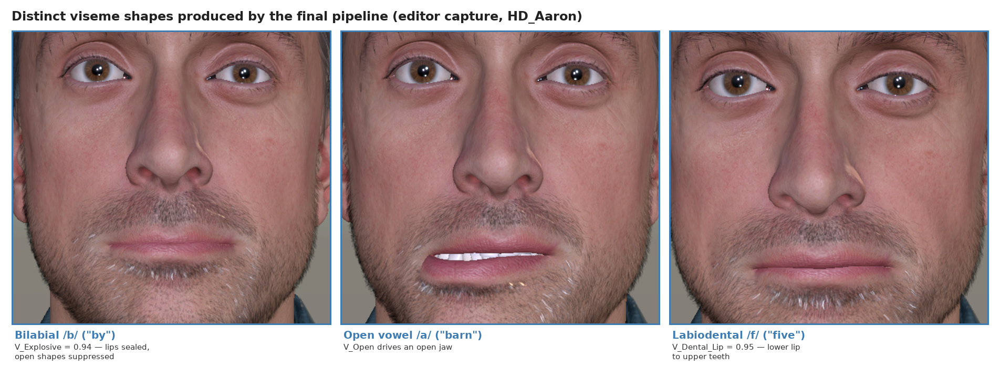
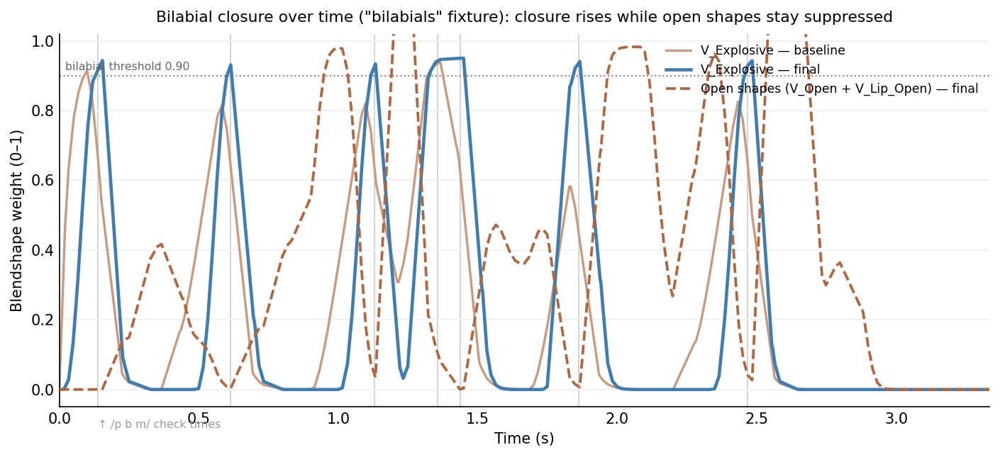

# DementiaGuide AI — Mid-Year Progress Report: Methodology, Results, Discussion, Conclusion (Working Draft)

**Author:** Richman Tan · **Supervisor:** Assoc. Prof. Jing Sun · **Project Partner:** JooHyun Kang
**Report:** COMPSYS/ELECTENG/SOFTENG 700 Mid-Year Progress Report

> **Confirmed framing (interpretation B).** The mid-year deliverable is a *progress report that expects early results*, not a proposal. The report should evolve from `Introduction → Literature Review → Proposed Solution → Project Plan` into:
> **Introduction → Background and Literature Review → Research Objectives → Methodology → Implementation Progress → Results → Discussion → Limitations and Future Work → Conclusion.**
> Existing proposal content is reused; *Proposed Solution* and *Project Plan* are updated to reflect actual progress. This document drafts the new empirical sections (Methodology of the evaluation, Implementation Progress, Results, Discussion, Limitations and Future Work, Conclusion).
>
> **Honesty boundary.** The lip-sync evaluation is real, quantitative, and reproducible. It validates **one required component** — that the avatar can articulate speech accurately enough for the proposed system. It does **not** assess the accessibility, personalisation, or usability of DementiaGuide AI; those depend on the human evaluation planned for the second half of the project. No data, numbers, or citations are invented. Section numbers below assume the full-report structure above; adjust to your final numbering.
>
> **Note — one reference to add:** the co-articulation engine follows the Cohen–Massaro dominance model, which is not yet in your reference list. `[CITATION REQUIRED: Cohen, M. M., & Massaro, D. W. (1993). Modeling coarticulation in synthetic visual speech. In Models and Techniques in Computer Animation (pp. 139–156). Springer.]`

---

## A. Evidence audit

**Research question (§2.1):** *How can an AI-powered avatar-based interface improve the accessibility, personalisation, and usability of digital resource management systems for dementia care?*

| Objective (§2.3) | Evidence now | Status |
|---|---|---|
| O1 Literature review | Report §3 | Done |
| O2 Identify gaps | Report §3.9 | Done |
| O3 Design avatar-based conversational interface | Prototype implemented | Built; not user-evaluated |
| O4 Develop prototype (AI personalisation + resource management) | RAG chat, voice pipeline, CC4 avatar, UaaL bridge implemented | Built; only articulation sub-system evaluated |
| O5 Evaluate usability and effectiveness | No human study yet | **Outstanding (700B)** |

**Evidence map**

| Sub-question / aim | Evidence | Main finding | Fig/Table | Confidence / limitation |
|---|---|---|---|---|
| SQ3 avatar role (articulation-fidelity precondition) | Automated lip-sync loop; baseline vs final; 8 fixtures, 95 checks | Checks 37/85 → 85/85 (hand-authored); 95/95 with G2P | T1, T2, F1, F2 | High for editor; deterministic, no human raters |
| bilabial closure | V_Explosive + open-shape suppression | 2/7 → 7/7; final 0.93–0.95; leakage ≤ 0.08 | T2, F2 | Editor only |
| labiodental contact | V_Dental_Lip | 4/7 → 7/7; final ≥ 0.94 | T2 | Editor only |
| tongue activation | V_Tongue_* | all 27 baseline 0.00 → 0.40–0.72 | T2 | Editor only |
| silence / segment-end | leakage + decay | leakage ≤ 0.54 → ≤ 0.10; decay 313–324 ms → 30–95 ms | T2 | Editor only |
| real G2P vs heuristics | g2p fixture 10/10 | passes; no baseline, not isolated | T1 | Partial |
| motion smoothness | jitter RMS | **increased on every fixture** | T2 | Negative finding |
| SQ1/2/4/5 usability, personalisation, decision support, literacy | None | — | — | **Outstanding (700B)** |
| RAG grounding reliability | Config only; protocol defined (§4.3) | — | — | Not evaluated — ready to run |
| Voice latency | Instrumented (6 stages); protocol + template defined (§4.2, Table 3); no dataset | — | — | Not measured — ready to run |

**Still required:** (1) human usability study [central]; (2) latency dataset; (3) RAG grounding evaluation; (4) on-device confirmation; (5) the Cohen–Massaro citation above.

---

## B. Confirmed report structure

`Introduction → Background and Literature Review → Research Objectives → Methodology → Implementation Progress → Results → Discussion → Limitations and Future Work → Conclusion.`

This document drafts the sections in **bold** below (Methodology is scoped to the evaluation of the component that has results):

- **4. Methodology (evaluation of the avatar articulation component)**
- **5. Implementation Progress**
- **6. Results** — 6.1 setup · 6.2 overall pass rate (T1, F1) · 6.3 bilabial (T2, F2) · 6.4 labiodental · 6.5 tongue · 6.6 silence/end · 6.7 G2P · 6.8 smoothness
- **7. Discussion**
- **8. Limitations and Future Work**
- **9. Conclusion**

---

## C. Draft sections

### 4. Methodology

*The project methodology spans interface design, prototype implementation, and evaluation. Section 4.1 describes the evaluation method for the component that has produced results at the mid-point — the avatar lip-synchronisation pipeline. Sections 4.2 and 4.3 define the evaluation protocols for the streaming voice latency and the retrieval-augmented (RAG) grounding, which are implemented and ready to run but have not yet been executed; no data has been collected for them and none is reported below.*

#### 4.1 Avatar articulation evaluation

The avatar's speech articulation was evaluated with an automated test loop inside the Unity Editor. An automated, metric-based approach was chosen over informal visual inspection so that each design iteration could be scored the same way, objectively and reproducibly, and so that the evaluation could serve as a standing regression test as the wider system develops. The loop plays a fixture through the same message entry point the production application uses, records the avatar's blendshape weights each frame, and scores the recording against fixed acceptance criteria.

**Fixtures.** Eight fixtures were used. Seven were hand-authored ARPAbet utterances chosen to exercise all 14 visemes and the known difficult cases (bilabial /p b m/ closures, labiodental /f v/ contact, dental and other tongue consonants, rounded vowels, sibilants and rhotics, and silence gaps). The eighth (`g2p_pipeline`) was produced by passing text through the JavaScript grapheme-to-phoneme (G2P) pipeline, exercising the real production text path. Fixtures are deterministic, so each represents one fixed utterance rather than a sample of natural speech.

**Metrics.** Each fixture embeds timed checks scored by six criteria: bilabial closure (`V_Explosive` ≥ 0.90 within ±60 ms, with open-mouth shapes suppressed), labiodental contact (`V_Dental_Lip` ≥ 0.80), tongue activation (mapped tongue shape ≥ 0.30), vowel peak (≥ 0.35), silence (all lip shapes < 0.10), and segment-end decay (all lip shapes < 0.05 within 250 ms). Motion smoothness was additionally reported as the root-mean-square of the second difference of all curves on a 60 Hz grid ("jitter RMS"); jitter was recorded for each run but was not one of the pass/fail criteria.

**Design.** The same suite was run against the pipeline before the co-articulation redesign (the *baseline*) and after it (the *final* pipeline), giving a controlled before-and-after comparison. Weights were baked and recorded at high frame rate (approximately 90 Hz), giving 147 to 202 samples per fixture, and a screenshot was captured at each check time.

#### 4.2 Streaming voice latency evaluation (protocol; not yet executed)

The voice pipeline is instrumented with stage timestamps that print a `[LATENCY SUMMARY]` record to the console after each spoken response. Six stage durations are recorded: speech-to-text (`stt_ms`), retrieval (`rag_ms`), language-model time to first token (`llm_to_token_ms`), first token to first complete sentence (`first_sentence_ms`), first text-to-speech request to first audio (`tts_first_ms`), and the end-to-end time from the end of the user's speech to the first avatar audio (`to_first_audio_ms`), which is the primary responsiveness measure.

The planned protocol runs a fixed set of representative caregiver queries (for example, 20 questions drawn evenly from the knowledge-base categories) through the deployed application, records the `[LATENCY SUMMARY]` for each, and reports the median and the minimum-to-maximum range for each stage. Because the pre-optimisation build was not instrumented, the concurrent-playback improvement can be quantified only by re-running the same queries with concurrent playback disabled; if that comparison is not run, the improvement is reported qualitatively (see §8). Sample size, device, and network conditions must be stated with the results. Table 3 is the reporting template.

**Table 3.** Voice-pipeline latency by stage (reporting template; `[TO BE CAPTURED]`). Report the median and range in milliseconds over n queries; state n, device, and network.

| Stage | Median (ms) | Range (ms) |
|---|---|---|
| Speech-to-text (`stt_ms`) | `[TBC]` | `[TBC]` |
| Retrieval (`rag_ms`) | `[TBC]` | `[TBC]` |
| LLM time to first token (`llm_to_token_ms`) | `[TBC]` | `[TBC]` |
| First token → first sentence (`first_sentence_ms`) | `[TBC]` | `[TBC]` |
| TTS request → first audio (`tts_first_ms`) | `[TBC]` | `[TBC]` |
| **End to end → first avatar audio (`to_first_audio_ms`)** | `[TBC]` | `[TBC]` |

#### 4.3 RAG grounding evaluation (protocol; not yet executed)

The retrieval-augmented generation path retrieves the top five knowledge-base chunks (`TOP_K = 5`) above a cosine-similarity floor (`MIN_SIMILARITY = 0.25`) using `text-embedding-3-small`, then generates an answer with `gpt-4o-mini` (temperature 0.4). The planned evaluation uses a fixed question set of representative caregiver queries (drafted in `rag_eval_question_set.md`: 29 in-scope questions each mapped to an expected chunk, plus near-neighbour, boundary, and out-of-scope sets), split into in-scope questions (answerable from the 70-chunk knowledge base) and out-of-scope questions (outside dementia care), and reports three measures: retrieval hit rate (whether the human-identified relevant chunk appears in the retrieved five), answer groundedness (whether the generated answer is supported by the retrieved chunks, rated by a human or an LLM judge on a fixed rubric), and out-of-scope handling (whether the system appropriately declines or expresses uncertainty rather than fabricating content). Because sample sizes will be below 20 per category, results should be reported as counts rather than percentages. The question set, rater, and rubric must be reported for reproducibility.

### 5. Implementation Progress

At the mid-point, the prototype implements the core of the proposed pipeline (§4 of the proposal). A retrieval-augmented chat path grounds responses in a curated dementia-care knowledge base of 70 content chunks spanning seven categories (caregiving, clinical, communication, best-practices, home-safety, prevention, and wellbeing), using OpenAI `text-embedding-3-small` for retrieval (top five chunks above a 0.25 similarity floor) and `gpt-4o-mini` for generation. A streaming voice path performs speech capture, transcription, retrieval, generation, text-to-speech, and avatar playback, with concurrent sentence-level playback so speech begins before the full response is generated, and it is instrumented to record per-stage latency (§4.2). The avatar is a Reallusion Character Creator 4 (CC4) character rendered in Unity and embedded in the React Native application through a Unity-as-a-Library (UaaL) native bridge.

Of these components, only the avatar lip-synchronisation sub-system has been formally evaluated so far. The retrieval-augmented chat, the streaming voice path, and the end-to-end latency behaviour are implemented and functional but have not yet been measured against defined criteria; their evaluation is planned for the second half of the project (§8).

### 6. Results

The initial evaluation examined whether the avatar could produce sufficiently accurate speech articulation for use in the proposed system. This evaluation did not assess the overall usability or accessibility of DementiaGuide AI, but it provided early evidence that the avatar component could support further prototype development and user evaluation.

#### 6.1 Evaluation setup

Eight fixtures were evaluated, embedding 85 acceptance checks across the seven hand-authored fixtures and 95 checks including the G2P fixture. Recordings contained 147 to 202 samples per fixture.

#### 6.2 Overall acceptance-check pass rate

On the baseline pipeline, 37 of the 85 hand-authored acceptance checks passed. On the final pipeline, all 85 passed, and the `g2p_pipeline` fixture passed all 10 of its checks, giving 95 of 95 across the full suite (Table 1, Figure 1). Every fixture improved, with the largest absolute gain in the `bilabials` fixture (6 of 17 to 17 of 17).

**Table 1.** Acceptance checks passed per fixture, baseline versus final pipeline. The `g2p_pipeline` fixture was introduced with the final pipeline and has no baseline.

| Fixture | Baseline (passed / total) | Final (passed / total) |
|---|---|---|
| bilabials | 6 / 17 | 17 / 17 |
| dental | 4 / 13 | 13 / 13 |
| labiodental | 9 / 16 | 16 / 16 |
| sibilant_rhotic | 6 / 13 | 13 / 13 |
| hello | 4 / 11 | 11 / 11 |
| silence_gaps | 4 / 9 | 9 / 9 |
| rounded | 4 / 6 | 6 / 6 |
| **Subtotal (hand-authored)** | **37 / 85** | **85 / 85** |
| g2p_pipeline | — | 10 / 10 |
| **Total** | — | **95 / 95** |

**Figure 1.** Acceptance checks passed per fixture on the baseline and final pipelines. The light backdrop bar is the total number of checks in each fixture. The `g2p_pipeline` fixture has no baseline.

#### 6.3 Bilabial closure

Across the seven bilabial checks, two passed on the baseline pipeline and all seven passed on the final pipeline. On the baseline, `V_Explosive` peaks ranged from 0.58 to 0.94, and open-shape leakage during closure reached 0.15. On the final pipeline, all peaks were between 0.93 and 0.95, open-shape leakage stayed at or below 0.08, and jaw drive at or below 0.14 (Table 2). Figure 2 shows three distinct viseme shapes produced by the final pipeline, including the sealed lips of a bilabial closure.

**Figure 2.** Distinct viseme shapes produced by the final pipeline (Unity Editor capture of the HD_Aaron character): a bilabial closure with sealed lips, an open vowel, and a labiodental lip-to-teeth contact, each annotated with the measured blendshape weight at the check time. A like-for-like baseline screenshot is not available because the scene camera was reframed in the same change set; the before-and-after comparison is carried quantitatively by Figure 1 and Table 2.

Figure 3 traces the closure shape over the whole `bilabials` utterance. On the final pipeline (solid line), `V_Explosive` reaches the 0.90 threshold at each /p b m/ instant, and the summed open-mouth shapes (dashed) fall to near zero at those same instants, rising only for the vowels between closures. On the baseline pipeline (faded line), the closure peaks are lower and later at several checks.

**Figure 3.** Closure shape `V_Explosive` over time for the `bilabials` fixture, baseline versus final, with the summed open-mouth shapes (`V_Open` + `V_Lip_Open`) on the final pipeline. The dotted line is the 0.90 acceptance threshold; grey verticals mark the /p b m/ check times. Open shapes rise for vowels between closures, which is expected, but are suppressed at the closure instants.

#### 6.4 Labiodental contact

Across the seven labiodental checks, four passed on the baseline pipeline and all seven passed on the final pipeline. Baseline peaks ranged from 0.525 to 0.90, with the lowest values ("V-of" at 0.525 and "F-fine" at 0.788) below the 0.80 threshold. Final peaks were all between 0.94 and 0.95.

#### 6.5 Tongue activation

On the baseline pipeline, all 27 tongue checks across the fixtures measured exactly 0.00, indicating the tongue shapes were unused. On the final pipeline, every tongue check passed, with measured peaks ranging from 0.40 to 0.72 (for example, `V_Tongue_up` reached 0.62 at the "N-no" check and 0.72 at the "D-would" check).

#### 6.6 Silence and segment-end behaviour

On the baseline pipeline, the three pause checks measured maximum lip weights of 0.15, 0.17, and 0.54, all above the 0.10 threshold, and every fixture took 313 to 324 ms to decay, above the 250 ms threshold. On the final pipeline, the pause checks measured 0.00, 0.04, and 0.10, and decay times fell to between 30 and 95 ms.

#### 6.7 Grapheme-to-phoneme pipeline fixture

The `g2p_pipeline` fixture passed all 10 of its checks on the final pipeline, including bilabial peaks of 0.91 to 0.95, labiodental peaks of 0.93 to 0.94, and a tongue reading of 0.40 at the dental check. No baseline was recorded for this fixture because it was introduced with the final pipeline.

#### 6.8 Motion smoothness

Jitter RMS increased on every fixture from baseline to final. Across the hand-authored fixtures it rose from a baseline range of 0.0056 to 0.0125 to a final range of 0.0115 to 0.0191 (for example, `bilabials` rose from 0.0125 to 0.0191 and `dental` from 0.0056 to 0.0124); the `g2p_pipeline` fixture measured 0.0270. No oscillation was observed in the recorded curves.

**Table 2.** Key articulation metrics by criterion, baseline versus final pipeline. Values are measured blendshape weights at the relevant check (0 to 1 scale) unless stated; decay is in milliseconds. Thresholds are the acceptance criteria.

| Criterion (threshold) | Baseline | Final |
|---|---|---|
| Bilabial `V_Explosive` peak (≥ 0.90) | 0.58 to 0.94 | 0.93 to 0.95 |
| Bilabial open-shape leakage (≤ 0.15) | up to 0.15 | ≤ 0.08 |
| Labiodental `V_Dental_Lip` peak (≥ 0.80) | 0.525 to 0.90 | 0.94 to 0.95 |
| Tongue shape peak (≥ 0.30) | 0.00 (all 27 checks) | 0.40 to 0.72 |
| Silence max lip weight (< 0.10) | 0.15, 0.17, 0.54 | 0.00, 0.04, 0.10 |
| Segment-end decay (< 250 ms) | 313 to 324 ms | 30 to 95 ms |
| Jitter RMS (reported, not gated; lower = smoother) | 0.0056 to 0.0125 | 0.0115 to 0.0191 |

### 7. Discussion

**Research question and the role of this result.** The project asks how an AI-powered avatar-based interface can improve the accessibility, personalisation, and usability of digital resource management for dementia care (§2.1). The literature reviewed in §3.6 argued that avatars may improve engagement and accessibility over text-only agents, but that the dementia-care evidence remains limited to usability and acceptance rather than validated outcomes (Chattopadhyay et al., 2020; Rampioni et al., 2021; Stara et al., 2021). A precondition for any such benefit is that the avatar renders speech convincingly. This evaluation tested that precondition: whether a co-articulation model with explicit closure guarantees, combined with real grapheme-to-phoneme conversion, produces measurably accurate viseme articulation on the CC4 avatar.

**Answer.** For the automated editor evaluation, this narrow question was answered affirmatively. The final pipeline passed all 95 acceptance checks, against 37 of 85 comparable checks on the baseline, so the co-articulation engine met every articulation target the suite encodes. Accurate articulation is a necessary technical foundation for the proposed avatar interface; it is not, however, evidence of accessibility, personalisation, or usability, which require the human evaluation still to be conducted.

**Supporting evidence.** The strongest evidence is the bilabial and labiodental results. The closure-suppression pass raised `V_Explosive` peaks from a range dipping to 0.58 up to a consistent 0.93 to 0.95 while holding open-shape leakage at or below 0.08 (Table 2, Fig 2), the behaviour a viewer reads as the lips actually meeting on /p b m/. Labiodental contact rose from a minimum of 0.525 to at least 0.94. The silence result is similarly clear: pause leakage fell from as high as 0.54 to at most 0.10, and end-of-utterance decay fell from 313–324 ms to 30–95 ms. The tongue result shows previously dormant shapes are now driven, from 0.00 across all 27 baseline checks to a range of 0.40 to 0.72.

**Interpretation.** The gains match the mechanism that changed. The baseline linearly interpolated raw keyframes with a single smoothing constant, which under-drove short consonant closures and let vowel shapes bleed through; the failing baseline bilabial peaks (0.58 to 0.82) are what that under-articulation looks like numerically. The final engine bakes overlapping dominance envelopes with an explicit suppression pass that forces open shapes down while a closure is dominant, which explains both the higher closure peaks and the low open-shape leakage at the same instants. The jitter increase must be interpreted honestly: the baseline was probably smoother because it was *under-articulating* — flatter curves produce a smaller second difference — whereas the final pipeline moves the shapes further and faster to reach the targets, raising jitter without introducing oscillation. This is an evidence-based interpretation, not a measured decomposition. The `g2p_pipeline` result is encouraging but cannot isolate the contribution of G2P from that of the engine, because it has no baseline and was measured together with it.

**Comparison with existing literature.** The avatar work reviewed in §3.6 evaluates dementia-care avatars almost entirely through usability and acceptance (for example the Anne agent study, Stara et al., 2021; the systematic review by Rampioni et al., 2021), and the broader patient-facing meta-analysis reports engagement benefits without establishing superior hard outcomes (Chattopadhyay et al., 2020). This study is complementary rather than directly comparable: it adds an objective, per-shape articulation-fidelity measure that those human-centred studies do not report, using reproducible thresholds rather than subjective ratings. Technically, the engine follows the dominance-envelope tradition of the Cohen–Massaro model, extended with an explicit closure-suppression pass that guarantees bilabial and labiodental contact `[CITATION REQUIRED: Cohen & Massaro, 1993 — add to references]`.

**Strengths.** The evaluation drives the production message entry point, so it measures the real playback path; it uses a controlled before-and-after design with the identical suite on both pipelines; and it reports the negative jitter result transparently rather than hiding it.

### 8. Limitations and Future Work

**Limitations.**
- *No human evaluation (central limitation).* The metrics are objective proxies for articulation, not perceptions of realism, engagement, accessibility, or usability. The research question is about human outcomes, none of which have been measured; this is the principal reason the headline question remains open, and it directly motivates Objective 5.
- *Deterministic fixtures, one utterance each.* Each fixture is a single scripted utterance, so results carry no variance estimate and no statistical test was performed; the word "significant" is used nowhere in this report. This limits generalisation to arbitrary live speech.
- *Editor-only.* On-device React Native playback was not verified; behaviour may differ because of frame-rate and bridge timing, weakening any claim about the shipped application until re-tested.
- *Jitter regressed*, and its cause was interpreted rather than isolated.
- *G2P not isolated* from the co-articulation engine by the current fixtures.
- *RAG grounding and latency unevaluated*, so no conclusion about the system's trustworthiness or responsiveness can yet be drawn.

**Future work (specific and actionable).**
1. *Human usability study (highest priority).* Recruit caregivers, and where appropriate healthcare professionals, to complete representative resource-finding tasks with the avatar interface versus a text-only baseline, measuring task success, time on task, and a standard usability instrument. This addresses SQ1, SQ4, SQ5 and Objective 5.
2. *On-device validation.* Re-run the identical fixture suite through the UaaL bridge on a physical iOS device to confirm the editor metrics hold under real timing.
3. *Perceptual lip-sync study.* Have raters blind-score final versus baseline clips to test whether the metric gains correspond to perceived realism.
4. *RAG grounding evaluation.* Execute the protocol defined in §4.3 — retrieval hit rate, answer groundedness, and out-of-scope handling against the 70-chunk knowledge base — to substantiate the trustworthiness claim central to a healthcare context.
5. *Latency measurement.* Execute the protocol defined in §4.2, capturing the six instrumented stage timings across representative queries (Table 3) to quantify responsiveness, ideally with concurrent playback toggled on and off to quantify that optimisation.
6. *Smoothness isolation and G2P ablation.* Sweep the smoothing constants to preserve closures without raising jitter, and compare the character-heuristic and CMUdict paths on identical text.

### 9. Conclusion

This project asks how an AI-powered avatar-based interface can improve the accessibility, personalisation, and usability of digital resource management for dementia care. At the mid-point, the DementiaGuide AI prototype implements the proposed pipeline — retrieval-grounded conversation, a streaming voice path, and an embodied CC4 avatar delivered to a mobile application through a native bridge — and the first component to be formally evaluated, the avatar's lip-synchronisation, was assessed with an automated, reproducible test loop. The redesigned pipeline passed all 95 articulation checks, compared with 37 of 85 comparable checks on the original pipeline. The strongest supporting evidence was the bilabial and labiodental closures, where measured peak weights rose to a consistent 0.93 to 0.95 while the mouth stayed correctly closed, and the silence behaviour, where end-of-utterance decay fell from over 300 ms to under 100 ms.

The main contribution so far is a reproducible, threshold-based method for producing and verifying accurate viseme articulation on an off-the-shelf CC4 avatar, including a closure-suppression step that guarantees lip contact on plosives. Two qualifications must be kept in view. First, motion smoothness regressed against the baseline, and the evaluation was confined to deterministic fixtures in the Unity Editor with no human raters and no on-device confirmation. Second, and more fundamentally, accurate articulation is only an enabling condition; the accessibility, personalisation, and usability questions at the heart of this project depend on human outcomes not yet measured.

The most important next step is therefore the human usability evaluation planned for the second half of the project: a task-based study with caregivers comparing the avatar interface against a text-only baseline. In short, this work shows that the avatar can be made to speak accurately and that this can be verified objectively; whether that accuracy translates into a more accessible, usable, and personalised experience for the people who provide dementia care is the question the project must answer next.

---

## D. Table and figure recommendations

- **Table 1** — checks passed per fixture. Keep. (Duplicates Figure 1; if space is tight keep one as primary.)
- **Table 2** — articulation metrics by criterion. Keep. Includes the corrected open-shape leakage row (≤ 0.08) and corrected tongue range (0.40 to 0.72).
- **Figure 1** — `figures/fig1_checks_passed.png` (generated). Grouped bar, baseline vs final, with total-checks backdrop.
- **Figure 2** — `figures/fig2_viseme_montage.png` (generated). Three distinct final-pipeline viseme shapes with measured weights. Caption already notes why a baseline screenshot pair is unavailable.
- **Figure 3** — `figures/fig3_bilabial_curves.png` (generated). `V_Explosive` over time for the `bilabials` fixture, baseline vs final, with summed open-shapes on the final pipeline. Shows the closure-and-suppression mechanism and the baseline-to-final improvement in one view. Optional if page budget is tight, since Table 2 and Figures 1–2 already carry the headline.
- **Table 3** — latency reporting template (§4.2), to be populated once the latency protocol is run.

---

## E. Claim verification table

| Draft claim | Evidence | Source | Support | Note |
|---|---|---|---|---|
| Final 95/95; baseline 37/85 comparable | summary + per-fixture metrics | both runs | Fully supported | g2p has no baseline — stated |
| Bilabial peaks 0.93–0.95; leakage ≤ 0.08 | bilabials_metrics.json | both runs | Fully supported | Corrected from earlier 0.14 (that was jaw) |
| Labiodental ≥ 0.94 (from min 0.525) | labiodental_metrics.json | both runs | Fully supported | — |
| Tongue 0.00 (all 27) → 0.40–0.72 | tongue checks | both runs | Fully supported | Corrected upper bound 0.62 → 0.72 |
| Silence leakage ≤ 0.54 → ≤ 0.10; decay 313–324 → 30–95 ms | silence/end checks | both runs | Fully supported | Broadened to all fixtures |
| Jitter increased on every fixture | jitterRms fields | both runs | Fully supported | Reported as regression |
| Engine follows Cohen–Massaro model | code + plan | CoarticulationEngine.cs | Partly supported | `[CITATION REQUIRED]` |
| Articulation gain → engagement/accessibility for PwD | — | none | **Unsupported** | Explicitly not claimed |
| G2P specifically improves accuracy | g2p fixture, no baseline | T1 | Partly supported | Not isolated from engine |
| RAG reliability / latency | config only | codebase | **Unsupported** | Implemented, not evaluated |
| Result holds on device | — | none | **Unsupported** | Editor-only |

---

## F. Final quality checklist

| Criterion | Status |
|---|---|
| Reports findings from collected data | Yes — baseline vs final metrics |
| Tables, graphs, figures | Yes — T1, T2, F1, F2 (F1/F2 generated) |
| Interpretation and comparison with published research | Yes — §7 uses the report's own avatar references; Cohen–Massaro flagged |
| Limitations and validity of the data | Yes — §8, human-evaluation gap central |
| Recommendations for future research | Yes — §8, six specific items |
| Separates results from interpretation | Yes — §6 factual, §7 interpretation |
| Reports negative/inconclusive findings | Yes — jitter, G2P non-isolation, unevaluated components |
| Avoids invented evidence | Yes |
| Answers the research question | Honestly bounded — enabling sub-question answered; headline RQ left open |
| Number-reporting rules | Yes — counts not percentages (n < 20), spaced units, leading zeros, ranges with "to", "significant" avoided |
| No unsupported claims | Yes — unsupported items flagged |

---

## G. Data provenance (reproducibility)

- Baseline run: `unity-avatar/UnityAvatarProject/TestResults/lipsync/20260711_231911/`
- Final run: `unity-avatar/UnityAvatarProject/TestResults/lipsync/20260712_000426/`
- Metric definitions / thresholds: `Assets/Scripts/Testing/LipSyncMetrics.cs`
- Co-articulation engine: `Assets/Scripts/LipSync/CoarticulationEngine.cs`
- Raw data: `<run>/<fixture>.csv`, `<run>/<fixture>_metrics.json`; screenshots: `<run>/<fixture>_<label>_<ms>.png`
- Figures generated into: `docs/report/figures/` — `fig1_checks_passed.png`, `fig2_viseme_montage.png`, `fig3_bilabial_curves.png`
- Latency instrumentation (stages / `[LATENCY SUMMARY]`): `src/hooks/useAvatarConversation.js`
- RAG parameters (`TOP_K`, `MIN_SIMILARITY`, models): `src/services/openaiService.js`; knowledge base (70 chunks, 7 categories): `src/data/knowledgeBase.js`
